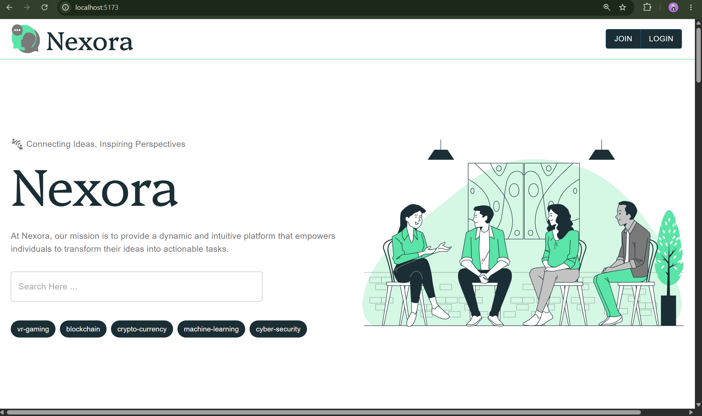
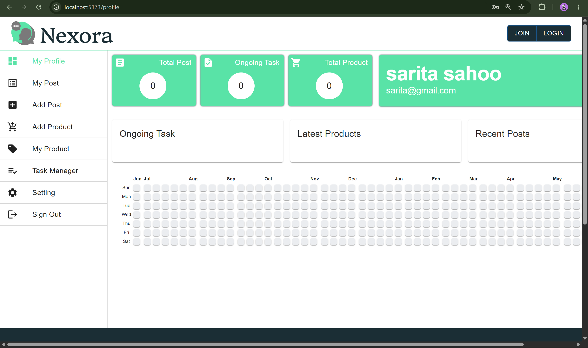
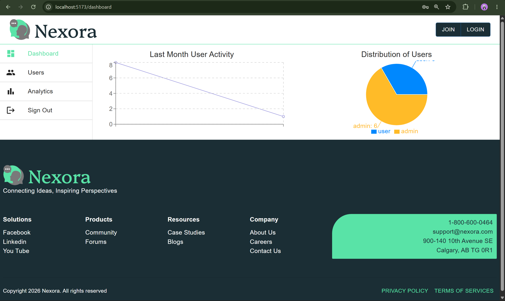

# 🚀 Nexora

Nexora is a full-stack MERN-based productivity and collaboration platform that enables users to manage tasks, create posts, showcase products, and interact through a secure authentication system. Built with scalability and modern web development practices in mind, Nexora provides separate user and admin experiences with powerful management and analytics capabilities.

---

# 📸 Preview

<p align="center">
    
</p>

### 👤 User Dashboard

<p align="center">
    
</p>

### 📊 Admin Analytics Dashboard

<p align="center">
    
</p>

# ✨ Features

## 👤 User Features

- Secure Authentication (JWT)
- User Registration & Login
- Profile Management
- Create, Edit & Delete Posts
- Product Management
- Task Management
- Password Change
- Responsive Dashboard
- Activity Tracking

---

## 🛡️ Admin Panel

Nexora includes a dedicated Admin Dashboard for monitoring platform activity and managing users.

### Admin Features

- 📊 Analytics Dashboard
- 👥 User Management
- 📈 Last Month User Activity Graph
- 📉 Role-Based User Distribution
- 📦 Product Statistics
- 📝 Post Statistics
- 📋 Task Statistics
- 🔍 Platform Overview
- Secure Admin Authentication

The analytics module uses MongoDB aggregation pipelines to generate real-time insights for administrators.

---

# 🛠 Tech Stack

## Frontend

- React
- Vite
- JavaScript
- Tailwind CSS
- React Router

## Backend

- Node.js
- Express.js

## Database

- MongoDB
- Mongoose

## Authentication

- JWT
- Cookies

## Other Tools

- Git
- GitHub
---

# 📂 Project Structure

```
Nexora
│
├── client
│   ├── components
│   ├── provider
│   ├── public
│   └── src
│
├── server
│   ├── controller
│   ├── controllers
│   ├── middleware
│   ├── models
│   ├── routes
│   └── config
│
├── assets
└── README.md
```

---

# ⚙️ Installation

## Clone Repository

```bash
git clone https://github.com/Subhrajit567/Nexora.git
```

## Install Backend

```bash
cd Nexora/server
npm install
npx nodemon index.js
```

## Install Frontend

```bash
cd ../client
npm install
npm run dev
```

---

# 🔑 Environment Variables

## Frontend (.env)

```env
VITE_SERVER_ENDPOINT=http://localhost:3000/api
VITE_TOKEN_KEY=nexora
VITE_USER_ROLE=role
VITE_COOKIE_EXPIRES=1
```

## Backend (.env)

```env
PORT=3000
DATABASE_URL=your_mongodb_connection_string
DATABASE_NAME = nexora
JWT_SECRET_KEY=your_secret_key
COOKIE_KEY=nexora
COOKIE_EXPIRES=5d

```

---

# 📊 Analytics Module

The Admin Dashboard provides real-time analytics using MongoDB aggregation pipelines.

It includes:

- Monthly User Registrations
- Role Distribution
- Product Statistics
- Post Statistics
- Task Completion Statistics
- Overall Platform Summary

These insights help administrators monitor application usage and user engagement effectively.

---

# 🚀 Future Enhancements

- Google OAuth Authentication
- Real-time Notifications
- Team Collaboration
- Live Chat
- AI-powered Task Suggestions
- Calendar Integration
- Dark Mode
- Email Verification
- Mobile App

---

# 🤝 Contributing

Contributions are welcome!

1. Fork the repository
2. Create a feature branch
3. Commit your changes
4. Push the branch
5. Open a Pull Request

---

# 👨‍💻 Author

**Subhrajit Sahoo**

- GitHub: https://github.com/Subhrajit567

---

# ⭐ Support

If you found this project useful, please consider giving it a ⭐ on GitHub.
